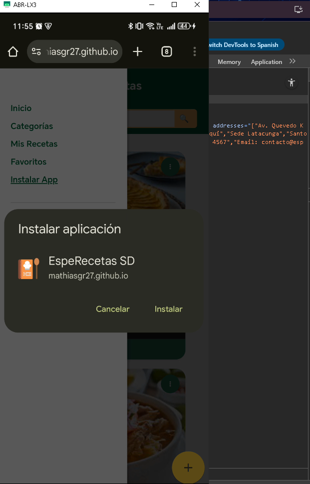
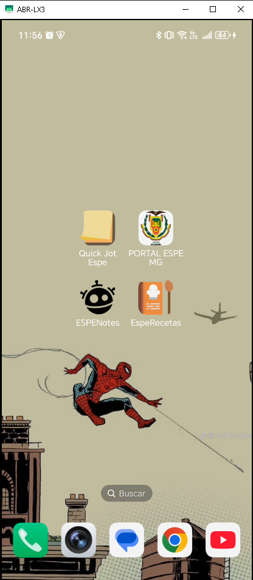
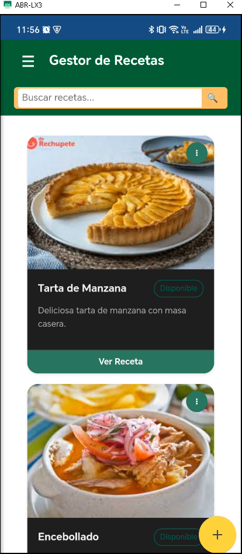
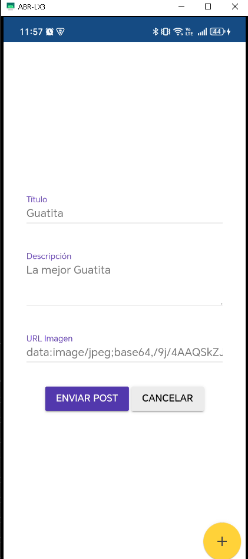
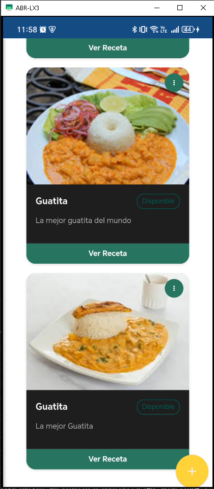
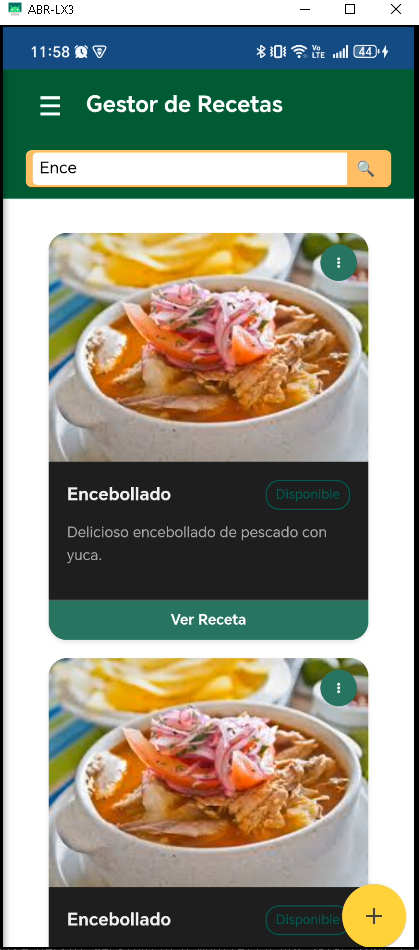
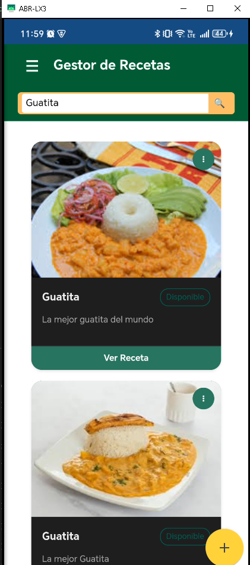
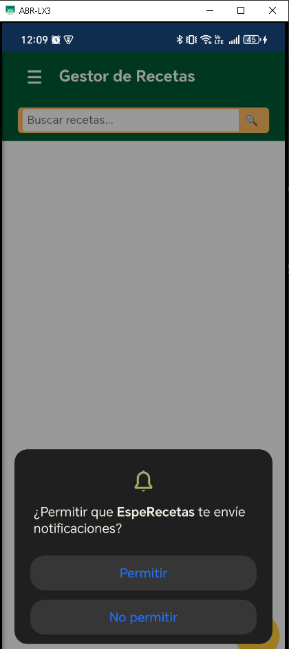
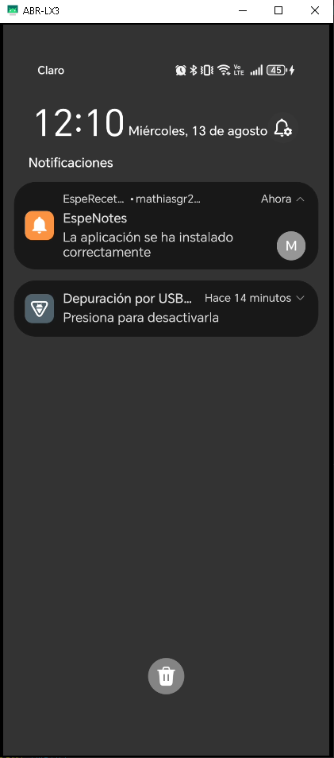

# EspeRecetas SD

Aplicación web progresiva (PWA) que permite visualizar recetas de manera sencilla, rápida y accesible desde cualquier dispositivo, incluso sin conexión a internet.

## Propósito
El objetivo principal de **EspeRecetas SD** es proporcionar a los usuarios una forma práctica de consultar recetas culinarias, ofreciendo:
- Una interfaz limpia y amigable.
- Instalación directa como aplicación en dispositivos móviles.
- Compatibilidad multi-plataforma.

---

## Tecnologías utilizadas
- **HTML5, CSS3 y JavaScript ES6**
- **Web Components nativos** para la creación de elementos reutilizables.
- **PWA** con `manifest.webmanifest` y `Service Worker` para funcionalidad offline.
- **JSON** como fuente de datos para las recetas.

---

## Créditos de desarrollo de componentes
- **`espe-product-card.js`** y **`espe-footer.js`** → desarrollados por **Grupo Proyecto C**.
- **`header-component.js`** → desarrollado por **Grupo Proyecto A**.

---

## Estructura del proyecto
src/
├── components/         # Componentes Web personalizados
│   ├── espe-footer.js
│   ├── espe-product-card.js
│   └── header-component.js
├── css/                # Estilos
│   └── app.css
├── data/               # Datos de recetas
│   └── recetas.json
├── images/             # Imágenes de recetas
│   ├── encebollado.jpeg
│   ├── tartamanzana.jpeg
│   └── icons/          # Iconos para PWA
├── app.js              # Lógica principal
├── index.html          # Página principal
├── manifest.webmanifest
└── sw.js               # Service Worker

---

## Instalación en dispositivos móviles
1. Abre la aplicación en el navegador de tu celular.
2. Desplega el menu 
2. Toca el botón **"Instalar App"** 
3. La app se instalará como si fuera una aplicación nativa.
4. Una vez instalada, podrás usarla .

---

## Capturas de pantalla

| Pantalla en el  github pages y instalacion | App instalada | Pagina Principal |
|--------------------|-----------------|-----------------|
|  |  |  |

| Formulario | Receta Agregada | Filtrado de busqueda | 
|--------------------|-----------------|-----------------|
|  |  |  |

| Filtrado de busqueda 2| Permitir Notificaciones | Notificacion |
|--------------------|-----------------|-----------------|
|  |  |  |

---

## Funcionalidades PWA
- **Alerta de Notificaciones** gracias al Service Worker (`sw.js`).
- **Instalación como app** mediante `manifest.webmanifest`.
- **Carga rápida** de recursos y datos.

---
